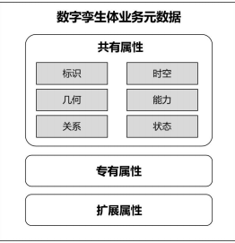
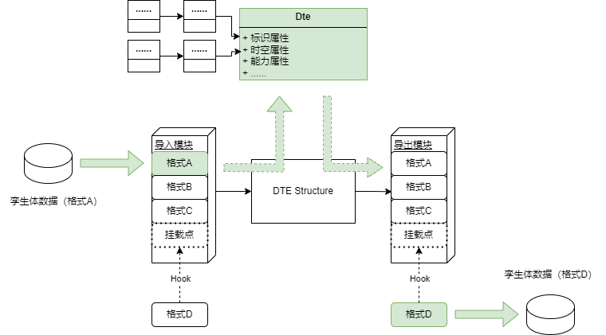
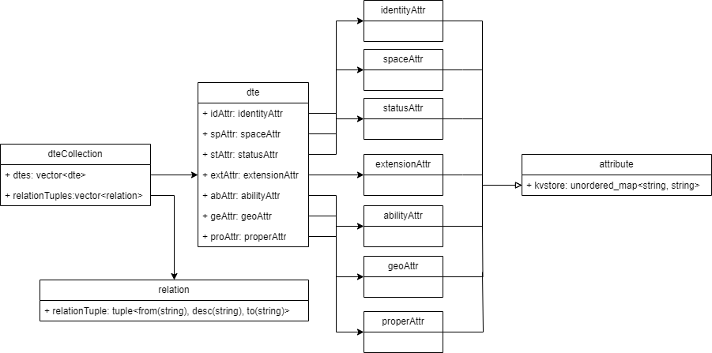

# 孪生体统一表达组件说明
## 总体设计与架构
> &emsp;&emsp;根据《数字孪生城市数字实体元数据》标准，数字孪生体分为八大类，业务元数据主要包括标识、时空、几何、能力、关系、状态、专有和扩展八大属性。  
> &emsp;&emsp;  

&emsp;&emsp;整个组件设计如下:  
  
&emsp;&emsp;组件由导入导出模块以及内存统一数据结构组成，以上路绿色箭头**数据流**为例，格式A的孪生体数据经过导入模块已挂载的格式A导入方法，导入到内存的统一数据结构中，接着通过导出模块挂载的格式D导出方法，导出成为格式D的孪生体数据。由此实现了可扩展的孪生体数据格式交换。

## 标准孪生体数据格式定义
- **统一内存数据结构**  
&emsp;&emsp;统一的内存数据结构定义如下：  

&emsp;&emsp;其中dte为孪生体对象，dteCollection为孪生体合集，除关系属性外，其他属性为dte对象的成员变量，取值均为可扩展的hashmap<string, string>。关系属性为dteCollection对象的成员变量，取值为关系三元组tuple。
&emsp;&emsp;各个属性的hashmap键对值取值定义为：  
&emsp;&emsp;**1. identityAttr标识属性：** 

    | 键值 | 说明 |
    | --- | --- |
    | basicTypeCode | 基础类型编码 |
    | industryTypeCode | 行业分类码 |
    | twinCode | 孪生体编码 |
    | twinTypeCode | 孪生体分类码 |
    | twinName | 孪生体名称 |

    &emsp;&emsp;**2. abilityAttr能力属性：**

    | 键值 | 说明 |
    |---|---|
    | abilityCode | 能力类型编码 |
    | abilityDesc | 能力描述 |
    | abilityId | 能力ID |
    | abilityName | 能力名称 |
    | abilityTime | 能力时间 |
    | abilityUpdateFrequency | 接口数据更新频率 |
    | abilityUrl | 能力访问（接口地址） |
    | abilityUrlInput | 接口输入参数 |
    | abilityUrlMethod | 接口请求类型（get/post） |
    | importTime | 入库时间 |
    | notes | 备注 |
    | sourceAbilityId | 原始项目中实体的能力属性唯一ID |

    &emsp;&emsp;**3. geoAttr几何属性（多个geo属性时，前缀为N-，如0-importTime）：**

    | 键值 | 说明 |
    |---|---|
    | importTime | 入库时间 |
    | notes | 备注 |
    | twinModelArea | 面积 |
    | twinModelCreateTime | 测取时间 |
    | twinModelDestroyTime | 移除时间 |
    | twinModelFilePath | 模型存储位置 |
    | twinModelFormat | 模型格式 |
    | twinModelHeight   | 高度 |
    | twinModelId | 模型ID |
    | twinModelLength | 长度 |
    | twinModelLod | 细节层次LOD |
    | twinModelName | 模型名称 |
    | twinModelSize | 大小 |
    | twinModelType | 模型类型 |
    | twinModelUrl | 模型服务地址 |
    | twinModelWidth | 宽度 |    

    &emsp;&emsp;**4. spaceAttr时空属性：**

    | 键值 | 说明 |
    |---|---|
    | altitude | 高程 |
    | createTime | 坐标系统 |
    | destroyTime | 消亡时间 |
    | latitude | 纬度坐标 |
    | longitude | 经度坐标 |
    | updateTime | 更新时间 |

    &emsp;&emsp;**5. statusAttr状态属性：**

    | 键值 | 说明 |
    |---|---|
    | importTime | 入库时间 |
    | notes | 备注 |
    | sourceStateId | 原始项目中实体的状态属性唯一ID |
    | stateCode | 状态类型编码 |
    | stateDesc | 状态描述 |
    | stateId | 状态信息表ID |
    | stateName | 状态名称 |
    | stateTime | 状态时间 |
    | stateUnit | 状态单位 |
    | stateUpdateFrequency | 接口数据更新频率 |
    | stateUrl | 状态访问（接口地址） |
    | stateUrlInput | 接口输入参数 |
    | stateUrlMethod | 接口请求类型（get/post） |  

    &emsp;&emsp;**6. extendAttr扩展属性（实际键值为"前缀-键值",如deviceExtProperty-systemClass）：**
    | 前缀 | 说明 |
    |---|---|
    | deviceExtProperty | 能耗设备扩展属性 |
    | identityExtProperty | 孪生体行业标识码扩展属性 |  

    - **能耗设备扩展属性：**  

    | 键值 | 说明 |
    |---|---|
    | systemClass | 系统分类 |
    | systemClass | 二级系统分类 |

    - **孪生体行业标识码扩展属性：**  

    | 键值 | 说明 |
    |---|---|
    | industryIdentityCode | 行业标识代码 |
    | sourceDepartment | 来源部门 |
    | sourceSystem | 来源系统 |

    &emsp;&emsp;**7. properAttr专有属性（实际键值为"前缀-键值",如aae-aaeAuthor）：**

    | 前缀 | 说明 |
    |---|---|
    | aae | 【文物】专有属性 |
    | building | 【建筑物与人工构筑物】专有属性 |
    | construction | 人工构筑物 |
    | device | 【物品和设备】专有属性 |
    | itEqu | 信息化设备属性 |
    | legalPD | 法人和其他组织属性 |
    | mountain | 自然实体-山体属性 |
    | naturalPD | 自然人属性 |
    | other | 其他实体属性 |
    | otherBuilding | 【其他建筑物】专有属性 |
    | otherManagement | 其他管理单元 |
    | vehicle | 运载工具属性 |
    | water | 水系 |

    - **文物专有属性：**  
  
    | 键值 | 说明 |
    |---|---|
    | aaeAuthor | 作者 |
    | aaeCreateTime | 创作时间 |
    | aaeIntroduction | 简介 |
    | aaeMaterial   | 材质 |
    | aaeSize | 尺寸 |
    | aaeType | 类型 |
    | aaebrand | 品牌 |
    | aaemodel | 型号 |
    | aaeproducer | 生产厂商 |
    | aaeresponsibleDept | 主管部门 |
    | aaeunitPrice | 单价 |
    | aaeuse | 用途 |
    | name | 名称 |
    | pitchAngle | 俯仰角旋转值 |
    | rollingAngle | 偏航角旋转值 |
    | yawAngle | 横滚角旋转值 |  

    - **建筑物与人工构筑物专有属性：** 
  
    | 键值 | 说明 |
    |---|---|
    | administrativeDivisionCode | 所属行政区划代码 |
    | administrativeDivisionLevel | 所属行政区划等级 |
    | administrativeDivisionName | 所属行政区划名称 |
    | areaAboveGround | 地上面积 |
    | areaUnderGround | 地下面积 |
    | barrierFreeAccessibility | 无障碍通行能力 |
    | buildingHighestHeight | 建筑物最高点高度 |
    | buildingLandArea | 建筑占地面积 |
    | buildingTotalArea | 建筑总面积 |
    | computedFARArea | 计容面积 |
    | constructionBuildingNumber | 施工幢号 |
    | constructionCompany | 建设单位 |
    | constructionYear | 建造年份 |
    | earthquakeResistanceLevel | 抗震等级 |
    | elevatorNums | 电梯数 |
    | exemptedFARArea | 不计容面积 |
    | expectedServiceLife | 预期使用寿命 |
    | fireResistanceLevel | 消防等级 |
    | fireproofEnduranceRating | 耐火等级 |
    | floors | 层数 |
    | floorsAboveGround | 地上层数 |
    | floorsUnderGround | 地下层数 |
    | greenBuildingLevel | 绿色建筑等级 |
    | landParcelId | 地块号 |
    | landuse | 用地性质 |
    | location | 地址 |
    | mainEntrance | 主要出入口 |
    | name | 全称 |
    | openTime | 开放时间 |
    | ownerCompany | 权属人/单位 |
    | parcelId | 宗地号 |
    | primaryUse | 主要用途 |
    | publicSecurityBuildingNumber | 公安幢号 |
    | securityCheckType | 安全检查类型 |
    | shortName | 简称 |
    | structureSafetyLevel | 建筑结构安全等级 |
    | structureType | 结构类型 |
    | supervisionCompany | 监理单位 |
    - **人工构筑物专有属性：**  
    
    | 键值 | 说明 |
    |---|---|
    | administrativeDivisionCode | 所属行政区划代码 |
    | administrativeDivisionLevel | 所属行政区划等级 |
    | administrativeDivisionName | 所属行政区划名称 |
    | buildingHighestHeight | 建筑物最高点高度 |
    | constructionCompany | 建设单位 |
    | constructionYear | 建造年份 |
    | designCompany | 设计单位 |
    | earthquakeResistanceLevel | 抗震等级 |
    | functionalClass | 功能分类 |
    | landuse | 用地性质 |
    | location | 地址 |
    | mainEntrance | 主要出入口 |
    | managementCompany | 管理单位 |
    | name | 全称 |
    | ownerCompany | 权属人/单位 |
    | primaryUse | 主要用途 |
    | shortName | 简称 |
    | structureType | 宗地号 |
    | undergroundEntrance | 地下出入口 |
    - **物品和设备专有属性：**        
    
    | 键值 | 说明 |
    |---|---|
    | deviceBrand | 品牌 |
    | deviceCode | 设备编码 |
    | deviceMaintainCompany | 养护单位名称 |
    | deviceModel | 型号 |
    | deviceOwnerCompany | 权属单位名称 |
    | deviceOwnerLocation | 所属地点 |
    | deviceProducer | 生产厂家 |
    | devicePurchaseDate | 购买日期 |
    | deviceResponsibleDept | 主管部门 |
    | deviceSNNumber | 产品SN号 |
    | deviceSerialNumber | 出厂编号 |
    | deviceSpecification | 规格/功能参数 |
    | deviceSupplier | 供应商 |
    | deviceType | 设备类型 |
    | deviceUnitPrice | 单价 |
    | deviceUse | 设备用途 |
    | name | 名称 |
    | pitchAngle | 俯仰角旋转值 |
    | rollingAngle | 横滚角旋转值 |
    | yawAngle | 偏航角旋转值 |
    - **信息化设备专有属性：**        
    
    | 键值 | 说明 |
    |---|---|
    | infoDeviceBrand | 品牌 |
    | infoDeviceCode | 设备编码 |
    | infoDeviceIPProtectionLevel | IP防护等级 |
    | infoDeviceMaintainCompany | 养护单位 |
    | infoDeviceModel | 型号 |
    | infoDeviceOwnerCompany | 权属人/单位 |
    | infoDeviceOwnerLocation | 安装位置 |
    | infoDevicePowerConsumption | 功耗参数 |
    | infoDevicePowerSupplyMode | 供电方式 |
    | infoDeviceProducer | 生产厂商 |
    | infoDevicePurchaseDate | 购买日期 |
    | infoDeviceResponsibleDept | 主管部门 |
    | infoDeviceSNNumber | 产品SN号 |
    | infoDeviceSerialNumber | 出厂编号 |
    | infoDeviceSpecification | 规格/功能参数 |
    | infoDeviceStorageHumidity | 贮存湿度 |
    | infoDeviceStorageTemperature | 贮存温度 |
    | infoDeviceSupplier | 供应商 |
    | infoDeviceType | 设备类型 |
    | infoDeviceUnitPrice | 单价 |
    | infoDeviceUse | 用途 |
    | infoDeviceWorkHumidity | 工作湿度 |
    | infoDeviceWorkTemperature | 工作温度 |
    | name | 名称 |
    | pitchAngle | 俯仰角旋转值 |
    | rollingAngle | 横滚角旋转值 |
    | yawAngle | 偏航角旋转值 |
    - **法人和其他组织专有属性：**        

    | 键值 | 说明 |
    |---|---|
    | administrativeDivision | 所属地区 |
    | administrativeInstitutionalLevel | 行政机构级别 |
    | administrativeLawQualified | 是否具备行政执法主体资格 |
    | administrativeSupervisionInfo | 行政监管情况 |
    | approvalDate | 核准日期 |
    | briefIntroduction | 简介 |
    | businessManagementInstitution | 业务管理机关 |
    | businessRegistrationNumber | 工商注册号 |
    | businessScope | 宗旨和业务范围 |
    | businessTermEnd | 经营(营业)截止日期 |
    | businessTermStart | 经营(营业)起始日期 |
    | developmentAndInnovationInfo | 发展创新情况 |
    | emailAddress | 电子邮箱 |
    | englishName | 英文名 |
    | establishmentDate | 成立日期 |
    | faxNumber | 联系传真 |
    | fudicialJudgmentInfo | 司法裁判情况 |
    | fulfillAgreementsAndPromisesInfo | 履约践诺情况 |
    | fundingSource | 经费来源 |
    | individuallyOwnedBusinessComposition | 个体工商户组成形式 |
    | industryClass | 行业门类 |
    | industryCode | 行业代码 |
    | isPubliclyListedCompany | 是否上市公司 |
    | legalRepresentative | 法定代表人或负责人 |
    | legalRepresentativeIDNumber | 法定代表人或负责人证件号码 |
    | legalRepresentativeIDType | 法定代表人或负责人证件类型 |
    | marketSubjectType | 市场主体类型 |
    | massOrganizationInstitutionalNature | 群团机关性质 |
    | name | 名称 |
    | organizationCode | 组织机构代码 |
    | otherName | 曾用名 |
    | paidInCapital | 实缴资本 |
    | personnelNums | 人员数量 |
    | phoneNumber | 电话号码 |
    | physicalBusinessAddress | 实际经营地址 |
    | publicCreditComprehensiveEvaluation | 公共信用综合评价 |
    | registeredAddress | 注册地址 |
    | registeredCapital | 注册资本 |
    | registeredCurrency | 注册币种 |
    | registeredType | 注册类型 |
    | registrationManagementInstitution   | 登记管理机关 |
    | socialOrganizationType | 社会组织类型 |
    | subjectType | 市场主体类型 |
    | taxpayerIdentificationNumber | 纳税人识别号 |
    | taxpayerQualification | 纳税人资质 |
    | tickerSymbol | 股票代码 |
    | unifiedSocialCreditIdentifier | 统一社会信用代码 |
    | unitSize | 单位规模 |
    | websiteURL | 官网 |
    - **自然实体-山体专有属性：**      
    
    | 键值 | 说明 |
    |---|---|
    | name | 入库时间 |
    | location | 名称 |
    | administrativeDivisionCode | 所属行政区划代码 |
    | administrativeDivisionLevel | 所属行政区划等级 |
    | administrativeDivisionName | 所属行政区划名称 |
    | mountainSlopeForm | 山体坡形 |
    | vegetationType | 植被覆盖 |
    | altitude | 海拔 |
    | connectedMountains | 连通山脉 |
    | mountainClimate | 山地气候 |
    | mountainOrientation | 山脉走向 |
    | mountainType | 山体种类 |
    | temperatureDiff | 温差 |
    | components | 组成成分 |
    | avgSlope | 平均坡度 |
    | avgAspect | 平均坡向 |
    | soilType | 地质/土质构造状态 |
    - **自然人专有属性：**       

    | 键值 | 说明 |
    |---|---|
    | name | 姓名 |
    | otherName | 曾用名 |
    | namePinYin | 姓名汉语拼音 |
    | IDType | 证件类型 |
    | IDNumber | 证件号码 |
    | nativePlace | 籍贯 |
    | gender | 性别 |
    | ethnicity | 民族 |
    | birthDate | 出生日期 |
    | birthPlaceCountry | 出生地国家和地区 |
    | birthPlaceDistrict | 出生地省市县区 |
    | chestCircumference | 胸围 |
    | waistCircumference | 腰围 |
    | hipCircumference | 臀围 |
    | hobbies | 兴趣爱好 |
    | militaryServiceStatus | 兵役状况 |
    | householdType | 户口类别 |
    | householdNumber | 户号 |
    | householdHeadName | 户主姓名 |
    | householdHeadIDNumber | 户主身份号码 |
    | relationshipWithHouseholder | 与户主关系 |
    | householdRegistrationAddressDistrict | 户籍地址省市县区 |
    | householdRegistrationAddressDetail | 户籍地址区划内详细地址 |
    | physicalAddressDistrict | 实际居住地址省市县区 |
    | physicalAddressDetail | 实际居住地址区划内详细地址 |
    | guardianship | 监护关系 |
    | guardianshipCode | 监护关系代码 |
    | fatherIDNumber | 父亲身份证件号码 |
    | fatherName | 父亲姓名 |
    | motherIDNuber | 母亲身份证件号码 |
    | motherName | 母亲姓名 |
    | spouseIDType | 配偶证件类型 |
    | spouseIDNumber | 配偶证件号码 |
    | spouseName | 配偶姓名 |
    | spouseNationality | 配偶国籍 |
    | employer | 工作单位 |
    | employerTYSHXYDM | 工作单位统一社会信用代码 |
    | occupation | 职业 |
    | employmentDate | 参加工作时间 |
    | retirementStatus | 离退休状态 |
    | employmentStatus | 从业状态 |
    | workExperience | 工作经历 |
    | honorsAndAwards | 荣誉表彰 |
    | socialSecurityNumber | 社保编码 |
    | socialSecurityType | 社保类型 |
    | socialSecurityClass | 社保种类 |
    | creditStatus | 个人信用状态 |
    | loanInformation | 个人贷款信息 |
    | loanStatus | 贷款状态 |
    | illegalBehaviors | 违规违法行为 |
    | highestEducationDegreeAchieved | 最终学历 |
    | enrolledStatus | 就读状态 |
    | graduatedInstitution | 毕业院校 |
    | educationExperience | 教育经历 |
    | politicalStatus | 政治面貌 |
    | maritalStatus | 婚姻状况 |
    | causeOfDeathCode | 死亡原因代码 |
    | deathDate | 死亡日期 |
    | deathPlace | 死亡地点 |
    | causeOfDeath | 死亡原因 |
    | cancellationDate | 注销日期 |
    | mobilePhoneNumber | 手机号 |
    | emailAddress | 邮箱 |
    | otherContactInformation | 其他联系方式 |

    - **其他实体专有属性：**     
    
    | 键值 | 说明 |
    |---|---|
    | additionalInfo | 相关说明 |
    | biometric | 生物特征 |
    | createCompany | 创建人/单位 |
    | entityClass   | 类别 |
    | entityUse | 用途 |
    | healthInfo | 健康信息 |
    | managementInfo | 管理方信息 |
    | name | 名称 |
    | ownerCompany | 权属人/单位 |
    | quarantineInfo | 检疫信息 |
    - **其他建筑物专有属性：**  
    
    | 键值 | 说明 |
    |---|---|
    | name | 名称 |
    | primaryUse | 主要用途 |
    | structureType | 结构类型 |
    - **其他管理单元专有属性：**       
    
    | 键值 | 说明 |
    |---|---|
    | administrativeDivisionCode | 所属行政区划代码 |
    | administrativeDivisionLevel | 所属行政区划等级 |
    | administrativeDivisionName | 所属行政区划名称 |
    | approveCompany | 批准单位 |
    | createCompany | 创建单位 |
    | location | 地址 |
    | managementCompany | 管理单位 |
    | managementPerson | 管理责任人 |
    | managementPersonTel | 管理责任人电话 |
    | name | 名称 |
    | unitClass | 管理单元类别 |
    - **运载工具专有属性：**     
    
    | 键值 | 说明 |
    |---|---|
    | accidentNums | 事故次数 |
    | accidentType | 事故类型 |
    | airbagsNums | 安全气囊个数 |
    | aircraftType | 发动机（内燃机）型号 |
    | assistedDrivingSystems | 辅助驾驶功能 |
    | autonomousDrivingLevel | 自动驾驶等级 |
    | axleNums | 轴数 |
    | batteryCapacity | 电池容量 |
    | batteryType | 电池类型 |
    | cargoCapacity | 载货量 |
    | carriagesNums | 车厢数量 |
    | chargingMode | 充电方式 |
    | chargingTime | 充电时间 |
    | climbingSpeed | 爬升速度 |
    | curbWeight | 整备质量 |
    | dataInterfaceType | 数据接口类型 |
    | dataTransmissionMode | 数据传输方式 |
    | descentSpeed | 下降速度 |
    | displacement | 排量 |
    | doorHeight | 门高度 |
    | doorNums | 门数量 |
    | doorWidth | 门宽度 |
    | draft | 吃水深度 |
    | driveType | 驱动形式 |
    | driver | 驾驶人/操作人 |
    | drivingComfort | 驾驶舒适性 |
    | drivingDuration | 行驶时长 |
    | drivingMileage | 行驶里程 |
    | drivingMileageSingle | 行驶公里数 |
    | drivingMode | 驾驶模式 |
    | drivingRoad | 行驶路段 |
    | drivingTime | 运行时间 |
    | emissionStandards | 排放标准 |
    | energyType | 能源类型 |
    | engineMaxNetPower | 发动机最大净功率 |
    | engineModel | 发动机（内燃机）型号 |
    | exteriorPaintColor | 外漆颜色 |
    | fuelGrade | 燃油标号 |
    | fuelTankCapacity | 油箱容积 |
    | glassType | 玻璃类型 |
    | industry | 所属行业 |
    | interiorHeight   | 内部高度 |
    | interiorTrimColor | 内饰颜色 |
    | licensePlateNumber | 车牌号 |
    | mainMaterial | 主要材质 |
    | maxFlyingAltitude | 最大飞行高度 |
    | maxPayload | 最大载重 |
    | maxSpeed | 最高速度 |
    | minGroundClearance | 最小离地间隙 |
    | name | 名称 |
    | navigationZone | 航区 |
    | operational | 是否为营运车辆 |
    | ownerCompany | 权属人/单位 |
    | parkingLocation | 停放位置 |
    | passengerCapacity | 载客量 |
    | powerSupplyMode | 供电方式 |
    | producer | 生产厂商 |
    | ridingComfort | 乘坐舒适性 |
    | route | 航线 |
    | runningSpeed | 运行速度 |
    | satelliteNavigationSystem | 卫星导航系统 |
    | seatMaterial | 座椅材质 |
    | shipAge | 船龄 |
    | shipType | 船舶类型 |
    | stallSpeed | 失速速度 |
    | stallSpeedSafetyMargin | 失速速度安全裕度 |
    | stationDisembarkationVolume | 站点下客量 |
    | stationEmbarkationVolume | 站点上客量 |
    | stationLoadingVolume | 站点上货量 |
    | stationUnloadingVolume | 站点卸货量 |
    | status | 状态 |
    | stoppingStation | 停靠站点 |
    | storageCapacity | 储物容积 |
    | storageTemperature | 存放环境温度 |
    | structuralStrength | 结构强度 |
    | trackWidth | 轨道宽度 |
    | trainType | 列车类型 |
    | transactionsNums | 交易次数 |
    | turningRadius | 转弯半径 |
    | use | 用途 |
    | wheelDiameter | 轮子直径 |
    | wheelbase | 轴距 |
    | wingspan | 翼展 |
    | workTemperature | 工作环境温度 |
    - **水系专有属性：**  
    
    | 键值 | 说明 |
    |---|---|
    | administrativeDivisionCode | 所属行政区划代码 |
    | administrativeDivisionLevel | 所属行政区划等级 |
    | administrativeDivisionName | 所属行政区划名称 |
    | flowDirection   | 水系流向 |
    | location | 地址 |
    | name | 名称 |
    | navigability | 通航情况 |
    | waterClass | 类别 |
    | waterQuality | 水质 |
    | waterRichMonths | 有水月份 |
    | waterUse | 地面水体用途 |
- **标准孪生体json格式**  
&emsp;&emsp;标准孪生体导出的json格式示例如下：
```
{
    "dtes": [
        {
            "ability": null,
            "extension": null,
            "geo": {
                "0-importTime": "",
                "0-notes": "",
                "0-twinModelArea": "173.649993896484",
                "0-twinModelCreateTime": "",
                "0-twinModelDestroyTime": "",
                "0-twinModelFilePath": "",
                "0-twinModelFormat": "glb",
                "0-twinModelHeight": "3.03999996185303",
                "0-twinModelId": "",
                "0-twinModelLength": "57.2099990844727",
                "0-twinModelLod": "",
                "0-twinModelName": "国科大楼-建筑主体（无机柜机架-四层2）",
                "0-twinModelSize": "1.76",
                "0-twinModelType": "三维精模",
                "0-twinModelUrl": "http://172.23.25.12/models/7fe4e162f5cfcc18eb005bee9dd63eb2.glb",
                "0-twinModelWidth": "73.2900009155273"
            },
            "identity": {
                "basicTypeCode": "建筑物与人工构筑物",
                "industryTypeCode": "",
                "twinCode": "DAD2024081206512400000002",
                "twinName": "四楼",
                "twinTypeCode": "其他建筑物"
            },
            "property": {
                "otherBuilding-name": "四楼",
                "otherBuilding-primaryUse": "机房",
                "otherBuilding-structureType": ""
            },
            "spaceTime": {
                "altitude": "0",
                "createTime": "2024-07-22",
                "crs": "国家2000",
                "destroyTime": "",
                "latitude": "31.2654955528546",
                "longitude": "120.724647845195",
                "updateTime": ""
            },
            "state": null
        },
        {
            "ability": null,
            "extension": null,
            "geo": {
                "0-importTime": "",
                "0-notes": "",
                "0-twinModelArea": "2310.09008789063",
                "0-twinModelCreateTime": "2024-12-19T16:00:00.000+00:00",
                "0-twinModelDestroyTime": "",
                "0-twinModelFilePath": "",
                "0-twinModelFormat": "glb",
                "0-twinModelHeight": "27.0400009155273",
                "0-twinModelId": "",
                "0-twinModelLength": "85.4400024414063",
                "0-twinModelLod": "",
                "0-twinModelName": "国科大楼-建筑主体（无机柜机架2）",
                "0-twinModelSize": "3.92",
                "0-twinModelType": "三维精模",
                "0-twinModelUrl": "http://172.23.25.12/models/772517414894982a8d8783b4ddd77e20.glb",
                "0-twinModelWidth": "76.870002746582"
            },
            "identity": {
                "basicTypeCode": "建筑物与人工构筑物",
                "industryTypeCode": "",
                "twinCode": "DAD2024122015400600000001",
                "twinName": "国科机房建筑外观",
                "twinTypeCode": "多层建筑"
            },
            "property": {
                "building-administrativeDivisionCode": "A003",
                "building-administrativeDivisionLevel": "Level7",
                "building-administrativeDivisionName": "江苏省苏州市",
                "building-areaAboveGround": "0",
                "building-areaUnderGround": "0",
                "building-barrierFreeAccessibility": "",
                "building-buildingHighestHeight": "25.75",
                "building-buildingLandArea": "15000",
                "building-buildingTotalArea": "57387.51",
                "building-computedFARArea": "32219.07",
                "building-constructionBuildingNumber": "",
                "building-constructionCompany": "苏州工业园区科技发展有限公司",
                "building-constructionYear": "",
                "building-earthquakeResistanceLevel": "",
                "building-elevatorNums": "",
                "building-exemptedFARArea": "25168.44",
                "building-expectedServiceLife": "",
                "building-fireResistanceLevel": "",
                "building-fireproofEnduranceRating": "",
                "building-floors": "0",
                "building-floorsAboveGround": "4",
                "building-floorsUnderGround": "2",
                "building-greenBuildingLevel": "",
                "building-landParcelId": "",
                "building-landuse": "商业服务业设施用地B",
                "building-location": "星湖街328号",
                "building-mainEntrance": "",
                "building-name": "国科机房建筑外观",
                "building-openTime": "",
                "building-ownerCompany": "",
                "building-parcelId": "",
                "building-primaryUse": "商场",
                "building-publicSecurityBuildingNumber": "",
                "building-securityCheckType": "",
                "building-shortName": "",
                "building-structureSafetyLevel": "",
                "building-structureType": "",
                "building-supervisionCompany": ""
            },
            "spaceTime": {
                "altitude": "0",
                "createTime": "2024-08-08",
                "crs": "国家2000",
                "destroyTime": "",
                "latitude": "31.2654955528546",
                "longitude": "120.724647845195",
                "updateTime": ""
            },
            "state": null
        }
    ],
    "relationTuples": [
        {
            "desc": "包含于",
            "from": "四楼",
            "to": "国科机房建筑外观"
        }
    ]
}
```

## 自定义孪生体数据格式转换

- 挂载自定义导入函数  
  组件中导入导出的挂载由dteContext完成，如下图，importMap内置了DTE、DATABASE、API三种格式的导入，exportMap内置了DTE、DATABASE两种格式的导入
  ```c++
  dteContext::dteContext() {
	this->importMap = {
		{"DTE", nullptr},
		{"DATABASE", nullptr},
		{"API", apiImport}
	};
	this->exportMap = {
		{"DTE", dteExport},
		{"DATABASE", nullptr}
	};
  }
  ```  
  导入导出函数的定义如下：  
  ```c++
  typedef dteCollection (*importHandler)(std::string path);//path:导入的格式文件路径
  typedef int (*exportHandler)(std::string path, dteCollection entity);//path:导出的格式文件路径，entity:需要导出的内存结构。
  ```
  挂载导入函数的方式如下：
  ```c++
  dteCollection test(std::string path) {//示例导入函数TEST。
        cout << path << endl;
        return 0;
  }

  dteContext dte;
  dte.addImportMap("TEST", test);//将TEST导入函数挂载到dteContext的importMap中。
  dte.getImportHandler("TEST")("MYTT");//获取该导入函数并调用。
  ```

- 挂载自定义导出函数  
  
  挂载导出函数的方式如下：
  ```c++
  int test(std::string path, dteCollection entity) {//示例导出函数TEST
    //....
  }

  dteContext dte;
  dteCollection d = dte.getImportHandler("API")("./content.json");//调用API导入函数导入到内存结构中
  try {
        dte.addExportMap("TEST", test);
        dte.getExportHandler("TEST")("./result.dte", d);//获取该导出函数并调用
  }
  catch (std::exception& e) {
        cout << e.what() << endl;
  }
  ```
- 导入导出示例
  
  ```c++
  int main() {
	SetConsoleOutputCP(CP_UTF8);
	dteContext dte;
	dteCollection d = dte.getImportHandler("API")("./content.json"); //获取园测导出的孪生体文件，导入到内存中
	cout << d.print() << endl;//调用dteCollection的print打印
	try {
		dte.getExportHandler("DTE")("./result.dte", d);//将内存中的数据导出为dte格式（自定义标准孪生体json格式）
	}
	catch (std::exception& e) {
		cout << e.what() << endl;
	}
  }
  ```
- 项目地址  
  
  https://github.com/codetea-fly/DTE_Framework

- 其他相关附件

  相关示例文件，资源文件均在项目地址github中。
  - **example/content.json** ：园测导出的孪生体数据
  - **example/result.dte** ：孪生体标准格式定义文件